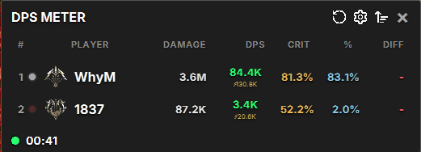
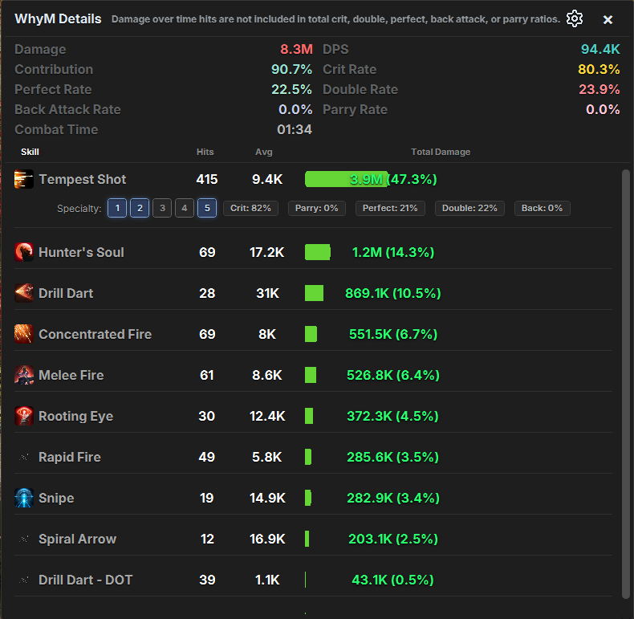

# Aion 2 DPS Meter

> **เครื่องมือวิเคราะห์การต่อสู้แบบเรียลไทม์สำหรับ AION 2**
>
> เวอร์ชันที่ปรับปรุงใหม่ พร้อมการปรับปรุงด้านความปลอดภัยของเธรดและสถาปัตยกรรมสมัยใหม่

[](../LICENSE)
[](https://kotlinlang.org)
[](https://openjfx.io)
[](https://github.com/nousx/aion2-dps-meter/releases)

[English](../README.md) | [한국어](README.ko.md) | [简体中文](README.zh-Hans.md) | [繁體中文](README.zh-Hant.md) | [Русский](README.ru.md)

---

## 📸 ภาพหน้าจอ

### หน้าจอหลัก DPS Meter


### รายละเอียดผู้เล่น


---

## ✨ ฟีเจอร์หลัก

- **ติดตาม DPS แบบเรียลไทม์** - อัปเดตทุก 100ms
- **วิเคราะห์สกิล** - วิเคราะห์โดยละเอียดพร้อมอัตรา Crit และ Specialty Slot
- **จัดอันดับปาร์ตี้** - เปรียบเทียบดาเมจกับสมาชิกในปาร์ตี้
- **Burst DPS** - วิเคราะห์ช่วงดาเมจสูงสุดด้วย Sliding Window 5 วินาที
- **ตรวจจับคลาสอัตโนมัติ** - ระบุคลาสของผู้เล่นโดยอัตโนมัติ
- **รองรับหลายภาษา** - อังกฤษ, เกาหลี, จีน (ตัวย่อ/ตัวเต็ม), ไทย, รัสเซีย
- **ปุ่มลัดส่วนกลาง** - สลับการแสดงผลและรีเซ็ตโดยไม่ต้องโฟกัสหน้าต่าง

---

## 📦 เริ่มต้นอย่างรวดเร็ว

### ความต้องการของระบบ
- **Windows 10/11** (x64)
- **Java 21+** ([ดาวน์โหลด](https://adoptium.net/temurin/releases/?version=21))
- **Npcap** ([ดาวน์โหลด](https://npcap.com/#download))
  - ⚠️ **ต้อง** เลือก "Install Npcap in WinPcap API-compatible Mode"

### ขั้นตอนการติดตั้ง

1. **ดาวน์โหลด** [Release](https://github.com/nousx/aion2-dps-meter/releases) ล่าสุด
2. **ติดตั้ง** Java 21+ และ Npcap
3. **รัน** ไฟล์ติดตั้ง MSI ในฐานะผู้ดูแลระบบ
4. **เปิด** แอปพลิเคชันในฐานะผู้ดูแลระบบ

### การตั้งค่าครั้งแรก

1. ไปที่หน้าเลือกตัวละคร (ถ้า AION 2 กำลังเปิดอยู่)
2. เปิด DPS Meter ในฐานะผู้ดูแลระบบ
3. อนุญาต Windows Firewall Prompt
4. เข้าสู่โลกเกม

**แก้ไขปัญหา:** ถ้า Meter ไม่แสดง ให้ลองวาร์ปโดยใช้ Kisk/Hideout หรือเข้า/ออกดันเจี้ยน

---

## 🎮 วิธีใช้งาน

### ปุ่มลัด
- **สลับการแสดงผล:** `Ctrl+Shift+H` (ปรับแต่งได้)
- **รีเซ็ต DPS:** `Ctrl+Shift+R` (ปรับแต่งได้)

### แผงรายละเอียด
คลิกที่ชื่อผู้เล่นเพื่อดู:
- ดาเมจรวมและ DPS
- เปอร์เซ็นต์การมีส่วนร่วม
- อัตรา Crit, Perfect, Back Attack
- การวิเคราะห์แต่ละสกิล
- การใช้งาน Specialty Slot (1-5)

---

## ❓ คำถามที่พบบ่อย

**Q: มีอะไรที่แตกต่างจาก DPS Meter ตัวอื่น?**

เวอร์ชันนี้เพิ่มการตรวจจับแพ็คเกตเกมอัตโนมัติ รองรับ VPN/Ping Reducer และถูกปรับปรุงใหม่ทั้งหมดเพื่อความปลอดภัยของเธรด รวมถึงมีการแปลภาษาอังกฤษสำหรับสกิลและ UI

**Q: ทำไมเห็นตัวเลขแทนชื่อ?**

การตรวจจับชื่อต้องใช้เวลาสักหน่อยเพราะเกมไม่ได้ส่งชื่อบ่อยนัก ลองใช้วาร์ปหรือไปที่ Legion Hall เพื่อเร่งให้เร็วขึ้น ถ้าใช้ ExitLag ให้เปิดตัวเลือก "Shortcut to restart all connections" และใช้มันเพื่อโหลดใหม่เร็วขึ้น

**Q: UI แสดงแล้วแต่ไม่มีดาเมจ**

- ตรวจสอบว่า Npcap ติดตั้งถูกต้อง
- ปิดแอพ ไปที่หน้าเลือกตัวละคร แล้วเปิดใหม่
- ลองวาร์ปเพื่อ Refresh การจับแพ็คเกต

**Q: เห็น DPS ของคนอื่นแต่ไม่เห็นของตัวเอง**

DPS คำนวณจากมอนสเตอร์ที่ถูกโจมตีมากที่สุด ตรวจสอบว่าคุณกำลังตีหุ่นฝึกตัวเดียวกับคนที่แสดงอยู่ใน Meter

**Q: เล่นคนเดียวแต่ Contribution ไม่ถึง 100%**

โดยปกติหมายความว่าการจับชื่อล้มเหลว ลองวิธีวาร์ปที่กล่าวถึงข้างต้น

**Q: ใช้คำสั่งแชทหรือเชื่อมต่อ Discord ได้ไหม?**

ยังไม่ได้ แต่อาจจะมีในอนาคต!

**Q: ทำไม Hit Count สูงกว่าจำนวนครั้งที่ใช้สกิล?**

สกิลที่ตีหลายครั้งจะนับแต่ละครั้งแยกกัน

**Q: บางสกิลแสดงเป็นตัวเลขแทนชื่อ**

โดยปกติคือ Theostones (เอฟเฟกต์จากอุปกรณ์) ถ้าเจอสกิลอื่นที่แสดงเป็นตัวเลข กรุณาแจ้งผ่าน [GitHub Issues](https://github.com/nousx/aion2-dps-meter/issues)

---

## 🛠️ Build จาก Source Code

```bash
# Clone repository
git clone https://github.com/nousx/aion2-dps-meter.git
cd aion2-dps-meter

# Build
./gradlew build

# สร้างไฟล์ติดตั้ง MSI
./gradlew packageMsi
```

---

## 📖 เอกสารประกอบ

- **[สถาปัตยกรรม](ARCHITECTURE.md)** - การวิเคราะห์ทางเทคนิคเชิงลึก
- **[บันทึกการเปลี่ยนแปลง](../CHANGELOG.md)** - ประวัติเวอร์ชัน
- **[คู่มือการมีส่วนร่วม](CONTRIBUTING.md)** - วิธีการมีส่วนร่วม *(เร็วๆ นี้)*

---

## 🔧 จุดเด่นทางเทคนิค

เวอร์ชันที่ปรับปรุงใหม่นี้มีการพัฒนาที่สำคัญ:

- ✅ **สถาปัตยกรรมที่ปลอดภัยต่อเธรด** - แก้ไข 3 Race Condition ความรุนแรงสูง
- ✅ **โครงสร้างโค้ดแบบโมดูล** - ลดโค้ดประมาณ 1,100+ บรรทัด
- ✅ **ข้อมูลสกิลแยกไฟล์** - 391 สกิลใน JSON ที่แก้ไขได้
- ✅ **ระบบ Logging แบบรวม** - ลดเธรดพื้นหลัง 67% (3→1)
- ✅ **ปรับแต่งประสิทธิภาพ** - ใช้ Atomic Operations แบบไม่ล็อก

**ผลกระทบ:**
- 🔒 State ที่แชร์ร่วมกัน 100% ได้รับการปกป้องอย่างถูกต้อง
- 📉 ลดโค้ดประมาณ 1,100+ บรรทัด
- 🏗️ StreamProcessor: 1009→400 บรรทัด (แยกเป็น 4 คลาส)
- 📝 DpsCalculator: 1100→280 บรรทัด
- ⚡ ลดเธรดพื้นหลัง 67%

---

## 🤝 การมีส่วนร่วม

ยินดีรับการมีส่วนร่วม! คุณสามารถ:
- รายงานบั๊กผ่าน [Issues](https://github.com/nousx/aion2-dps-meter/issues)
- ส่ง Pull Request
- เสนอฟีเจอร์หรือการปรับปรุง

---

## 📄 สัญญาอนุญาต

MIT License - ดูรายละเอียดที่ [LICENSE](../LICENSE)

**เครดิต:**
- ผลงานต้นฉบับ: [TK-open-public](https://github.com/TK-open-public/Aion2-Dps-Meter)
- พัฒนาต่อเนื่อง: [taengu](https://github.com/taengu/Aion2-Dps-Meter)
- เวอร์ชันปรับปรุงใหม่: SpecTruM

---

## ⚠️ ข้อจำกัดความรับผิด

เครื่องมือนี้มีไว้สำหรับ **การใช้งานส่วนบุคคลและการศึกษาเท่านั้น**
- ใช้งานโดยความเสี่ยงของคุณเอง
- ผู้พัฒนาไม่รับผิดชอบต่อผลที่ตามมาใดๆ
- กรุณาเคารพข้อกำหนดการให้บริการของเกม

---

## 📞 การสนับสนุน

- **Issues:** [GitHub Issues](https://github.com/nousx/aion2-dps-meter/issues)
- **Discord:** https://discord.gg/Aion2Global
- **เอกสาร:** [docs/](.)

---

**สร้างด้วย ❤️ สำหรับชุมชน AION 2**
